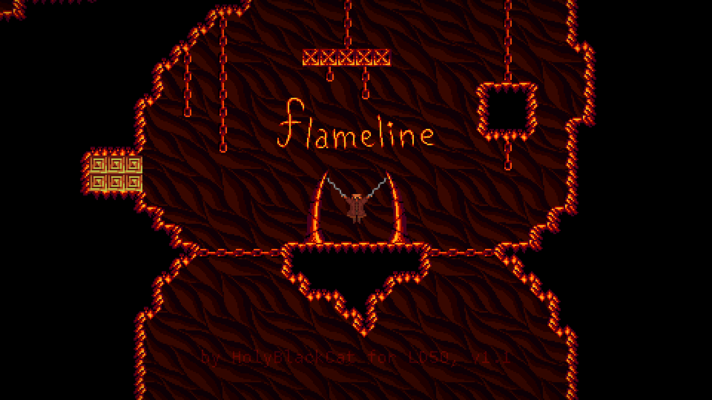

### Flameline

A small metroidvania with time travel, made for Ludum Dare \#50 in 48 hours.

Written in C++ using a [custom framework](https://github.com/HolyBlackCat/imp-re). Cross-compiled from Linux to Windows using [quasi-msys2](https://github.com/HolyBlackCat/quasi-msys2).

Grab the latest binaries at [itch.io](https://holyblackcat.itch.io/flameline) or at the [releases](https://github.com/HolyBlackCat/LD50-flameline/releases) page.

---

**Building**

MSVC is not supported. On Windows you need [MSYS2](https://stackoverflow.com/q/30069830). To cross-compile from Linux prefer [Quasi-MSYS2](https://github.com/HolyBlackCat/quasi-msys2).

Make sure the source directory path doesn't contain spaces.

You need at least following: latest `clang` (tested on Clang 14; on Windows prefer the version from MSYS2 repos), GCC 11 (for libstdc++), `lld`, `make`, `cmake`, `zip`, `unzip`, `tar`, `zstd`, `rsync`, `patchelf` (on linux only), `ldd`**/**`ntldd` (for linux and windows respectively).

On Linux you also need to install the dependencies of SDL2, listed somewhere in [`project.mk`](/project.mk) (or in SDL2 docs). On Windows we use prebuilt SDL2, so no dependencies are needed.

To build and run, simply do `make`. No `-j...` necessary.

If you get weird makefile errors, you might need to update `make`. Get source [here](http://ftp.gnu.org/gnu/make/), compile using `./configure && make && sudo make install`.

If you get "permission denied" for `/dev/pts/0`, add `MAKE_TERMOUT=` to `make` flags.

---

Licensed under [ZLIB LICENSE](LICENSE.md).
